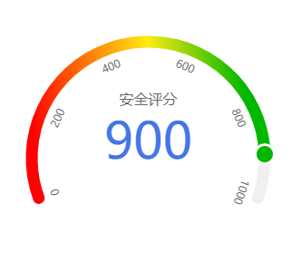

# 微信小程序仪表盘组件

<div align="center">
  
</div>
<div  align="center">
    
</div>


基于canvas开发，功能不断叠加

## 如何使用

第一步：在需要使用该组件地方的配置文件中加入

```json
{
  "usingComponents":{
    "gauge":"../../components/gauge" // 组件地址
  }
}
```

或者使用官方的npm支持文档中方案 https://developers.weixin.qq.com/miniprogram/dev/devtools/npm.html

第二步：在需要引用该组件的地方引入如下所示代码

``` react
  <gauge 
      height="750" 
      r="135" 
      bgWidth="13"
      gaugeid="g1"
      animateMsec="700" 
      scaleTextStyle="{{scaleTextStyle}}" 
      indicatorTextStyle='{{indicatorTextStyle}}'
      indicatorValueStyle='{{indicatorValueStyle}}'
      indicatorCircleStyle='{{indicatorCircleStyle}}'
      min="0"
      max="1000"
      value="900"
  />
```


**备注：数据刻度暂时定位人工分段，后期采用自动分割尺度**

## API

名称 类型 默认值  备注

| 名称                 | 类型                 | 默认值                                                       | 备注                                                         | 必填 |
| -------------------- | -------------------- | ------------------------------------------------------------ | ------------------------------------------------------------ | ---- |
| width                | `Number`             | 750                                                          | 表盘容器宽度，单位为`rpx`                                    | 否   |
| height               | `Number`             | 450                                                          | 表盘容器高度单位为`rpx`                                      | 否   |
| gaugeid              | `String `            | 'gauge' + Math.random()                                      | 表盘容器组件id，即`canvas`id                                 | 否   |
| r                    | ` Number `           | 95                                                           | 表盘半径，单位为`px`                                         | 否   |
| startAngle           | `Number`             | 80 / 90 * Math.PI                                            | 表盘开角，角度制                                             | 否   |
| endAngle             | `Number`             | 10 / 90 * Math.PI                                            | 表盘闭角，角度制                                             | 否   |
| bgColor              | `String`             | ` #f0f0f0`                                                   | 表盘底色                                                     | 否   |
| indicatorBgColor     | ` Array ` / `String` | 默认为数组，即渐变色，渐变色格式`[{progress:0,value:'#fff'},{progress:1,value:'red'}]`，详情参见源码 | 指示器颜色                                                   | 否   |
| bgWidth              | `Number`             | 15                                                           | 表盘宽度                                                     | 否   |
| min                  | `Number`             | 0                                                            | 最小值                                                       | 否   |
| max                  | `Number`             | 1000                                                         | 最大值                                                       | 否   |
| value                | `Number`             | 700                                                          | 指示器值                                                     | 否   |
| animateMsec          | `Number`             | 0                                                            | 动画时长（毫秒），0表示无动画                                | 否   |
| indicatorText        | `String`             | -                                                            | 指示器文本                                                   | 否   |
| scale                | `Array`              | [0,200,400,600,800,1000]                                     | 指示器标尺刻度                                               | 否   |
| indicatorTextStyle   | `Object`             | `{show:false,size:12,color:'#666',text:''}`                  | 指示器文本样式                                               | 否   |
| indicatorValueStyle  | `Object`             | `{show:false,size:18,color:'#4575e8'}`                       | 指示器值样式                                                 | 否   |
| indicatorCircleStyle | `Object`             | `{show:false,bgColor:'#00b800',r:9,borderRadius:3,borderColor:'#fff'}` | `borderColor`可以为数组，当为数组时采用径向渐变，数组格式同`indicatorBgColor` | 否   |
| scaleTextStyle       | `Object`             | `{show:fasle,size:16,color:#f0f0f0}`                         | 指示器标尺样式                                               | 否   |

